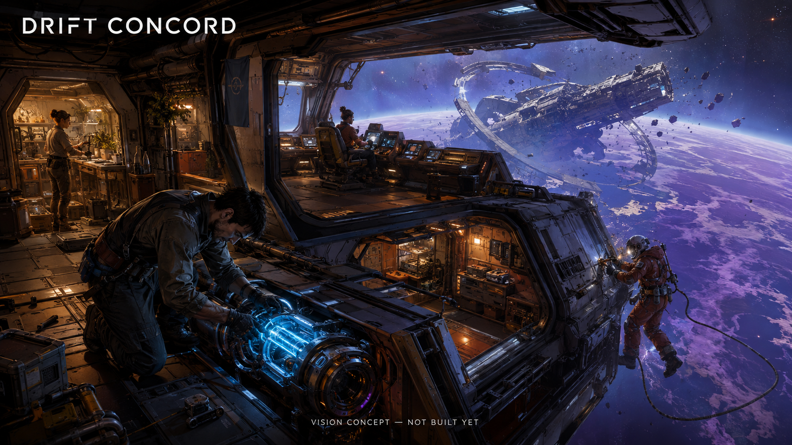

# Drift Concord

**A shared starship, a real crew and a galaxy of expeditions that communities can build and host.**

Space is more interesting when the ship only works because your friends do.

> This is a public planning repository. There is no product implementation or playable build yet. The image is an AI-generated vision reference, not a screenshot. All waves and tasks are proposed; no completed work, community approval or funding is implied.

## The mission

Build an open cooperative space adventure where a starship is a physical system the crew understands and operates together. Pilot through a hazard, reroute power, survey a wreck, recover something worth bringing home and tell the story at the next port.

Accept an expedition, prepare the ship, travel to a derelict, divide the work, improvise when a system fails and bring the crew home. Engineers and explorers should be as consequential as the pilot.

## Who this is for

Friends who want memorable cooperative expeditions, useful crew roles and ships they can learn rather than menus they must memorize.

## The first thing we want to prove

Four to eight players, one walkable ship, one derelict and one 20–30 minute salvage expedition with recovery and a debrief.

Crew roles often leave someone waiting. Measure meaningful decisions per role, downtime and what happens when one person leaves. A mission that only entertains the pilot must be redesigned.

## What this could become

Community fleets and connected sectors, persistent ship histories, player-made expeditions and an open ship-building toolset. Rich destinations and good teamwork come before a vast empty galaxy.

Crew-driven space games and open community servers already exist. The proposed focus is an approachable expedition game that combines tactile ship systems, shared problem solving, portable content and independent hosting.

## Why build it together

Contributors can own ship modules, mission packs, interaction tools, networking, accessibility, sound and playtests. A stable expedition format would let the community expand the game without every mission becoming an engine rewrite.

We are looking for founding maintainers and contributors who can make one small, reviewable part real. Bring a concrete use case, a difficult test case, an interface sketch or a focused patch. If you use a coding agent, give it one agreed task and review its result. Accepted work matters more than generated volume.

## How to join

Start with [the project on Tanduna](https://tanduna.com/projects/drift-concord). Read the [six-wave roadmap](ROADMAP.md) and [twelve proposed tasks](TASKS.md), then join the planning discussion and say which result you can help deliver. Propose scope before starting overlapping implementation. GitHub holds the source; Tanduna is where we organize the project and its community.

- **W1: Every seat matters.** Prove the crew loop with one expedition.
- **W2: One ship that behaves consistently.** Build the bounded systems needed by that mission.
- **W3: Bring the crew home.** Deliver the first complete cooperative run.
- **W4: Ships and stories persist.** Add identity without turning play into compulsory upkeep.
- **W5: An open fleet of communities.** Let independent operators host useful destinations.
- **W6: A game worth returning to.** Validate variety, performance and host workload.

## What we are not promising

No purchasable advantage or speculative ships. No full galaxy, seamless planets, advanced ship editor or massive fleet combat in the first slice. Community hosting still has real operating costs.

There is no delivery date, token target, paid offer or crowdfunding campaign here. Community interest does not guarantee a finished product. The next milestone depends on contributors, maintainer capacity and evidence from the previous one.

## Existing work we should learn from

- [Space Station 14](https://spacestation14.com/about/about/)
- [Veloren](https://book.veloren.net/introduction/what-is-veloren.html)

These are related foundations and references, not partners or endorsements. We should reuse compatible components or contribute upstream when that is the better route. This proposal does not claim that its individual ingredients are unprecedented. Dependencies and their licenses will be evaluated before adoption.

## License and contribution

This repository is published under [GNU AGPL-3.0](LICENSE). See [CONTRIBUTING.md](CONTRIBUTING.md) for the proposed contribution workflow and [the image note](assets/README.md) for concept provenance.
